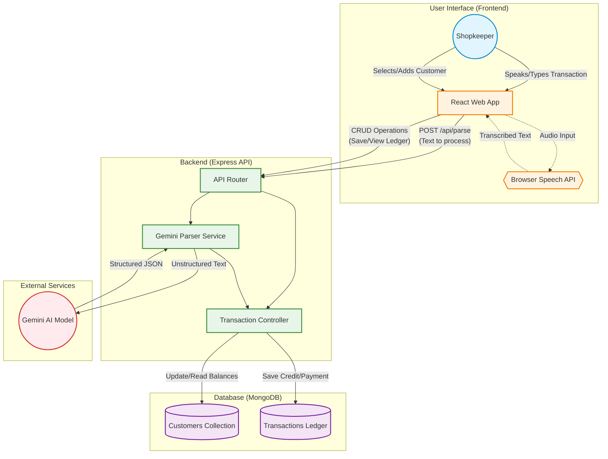

# Pesum Kanakku - Deep Project Documentation

## 1. Project Overview

**Pesum Kanakku** (meaning "Speaking Ledger" in Tamil) is a voice-first credit ledger application specifically designed for small shopkeepers (Kirana stores, petty shops) in Tamil Nadu. 

### 1.1 The Problem
In many local retail environments, shopkeepers rely heavily on physical paper ledgers to keep track of customer credits and payments. Traditional digital solutions (accounting software, complex apps) are often perceived as slow, confusing, and requiring too much manual data entry. While a shopkeeper remembers the customer, the items, and the amount perfectly, pausing to navigate a complicated UI breaks their workflow, especially during busy hours.

### 1.2 The MVP Solution
Pesum Kanakku tackles this by introducing a seamless, voice-driven workflow. Instead of navigating multiple screens and typing entries, the shopkeeper can simply speak the transaction in their native language or Tanglish (e.g., "Ramesh naaku oru paal packet pottuko, 25 rooba credit"). The system uses AI to parse the intent, amount, and items, allowing the shopkeeper to simply review and save the entry.

---

## 2. Core Features

The Minimum Viable Product (MVP) focuses strictly on the core ledger workflow:

*   **Customer Management:** Easily add new customers or select existing ones from a list.
*   **Voice-First Input:** Utilize the browser's native Speech Recognition API to capture spoken transactions.
*   **Manual Fallback:** A traditional text input field is provided in case of noisy environments or speech recognition failures.
*   **AI-Powered Parsing:** Leverages Google's Gemini AI to intelligently extract structured data (Items, Quantity, Price, Intent - Credit/Payment) from unstructured, conversational text.
*   **Review & Edit:** Presents the parsed data to the user for a final confirmation before saving, ensuring accuracy.
*   **Ledger Persistence:** Saves all verified transactions securely to a MongoDB database.
*   **Balance Tracking:** Maintains and displays real-time outstanding balances for each customer, along with their transaction history.

---

## 3. Architecture & System Flow

The system follows a modern client-server architecture, utilizing third-party AI services for natural language processing.

### 3.1 Component Breakdown

1.  **React Frontend:** The user-facing application providing the UI for customer selection, recording voice, and displaying ledgers.
2.  **Browser Speech API:** The built-in browser capability used to convert spoken audio into raw text strings.
3.  **Express Backend:** The central API that acts as a bridge between the frontend, the database, and the external AI service.
4.  **Gemini Parser Service:** A dedicated module within the backend that formats prompts and communicates with the Gemini API to extract meaningful JSON structures from the raw text.
5.  **MongoDB:** The NoSQL database used to store persistent data, featuring collections for Customers and Transactions.

---

## 4. Tech Stack

*   **Frontend:** React, HTML/CSS (Designed to be responsive and mobile-friendly).
*   **Backend:** Node.js, Express.js.
*   **Database:** MongoDB (Mongoose ODM).
*   **AI/NLP:** Google Gemini API (`gemini-2.5-flash` model recommended for speed).
*   **Speech-to-Text:** Web Speech API (Native Browser Support).

---

## 5. API Reference

The Express backend exposes the following RESTful endpoints:

### Customer Routes
*   `GET /api/customers` : Retrieve a list of all customers, including their current outstanding balances.
*   `GET /api/customers/:id` : Retrieve detailed information and the complete transaction history for a specific customer.
*   `POST /api/customers` : Create a new customer profile.

### Transaction Routes
*   `POST /api/transactions` : Save a new confirmed transaction (either a credit addition or a payment received) and update the associated customer's balance.
*   `GET /api/transactions` : Retrieve a list of recent transactions across all customers.

### AI Parsing Route
*   `POST /api/parse` : 
    *   **Payload:** `{ "text": "Raw transcribed text from the user" }`
    *   **Function:** Sends the text to the Gemini Parser Service.
    *   **Response:** Returns a structured JSON object detailing the recognized items, quantities, total amount, and transaction type.

---

## 6. Current Limitations & Considerations

As an MVP, the current system has specific boundaries:

*   **Browser Dependency:** The voice input heavily relies on the Web Speech API, which may have varying levels of support and accuracy across different browsers (Chrome is highly recommended).
*   **Network Requirement:** An active internet connection is mandatory for the Gemini API to process the natural language.
*   **Language Nuances:** Tamil and Tanglish speech recognition accuracy depends on the browser's engine and the user's dialect. It requires ongoing testing in real-world noisy environments.
*   **Security & Auth:** The MVP does not currently implement robust user authentication (login/signup) or role-based access control. It assumes a single-tenant environment for demonstration purposes.

---

## 7. Future Roadmap

To evolve from an MVP to a production-ready application, the following enhancements are planned:

1.  **Offline Support (PWA):** Implement service workers and local caching (e.g., IndexedDB) to allow offline transaction entry, syncing with the cloud once connectivity is restored.
2.  **Local NLP Fallback:** Integrate a lightweight, rule-based parser on the device to handle simple commands offline when the Gemini API is unreachable.
3.  **Authentication:** Add secure login (e.g., OTP via SMS) to protect shopkeeper data.
4.  **Multi-Tenant Architecture:** Structure the database to support multiple independent shops on the same platform.
5.  **SMS Integration:** Automatically send SMS receipts and balance reminders to customers upon saving a transaction.
6.  **Analytics Dashboard:** Provide insights to the shopkeeper, such as total pending credits, most frequent customers, and weekly collection trends.
