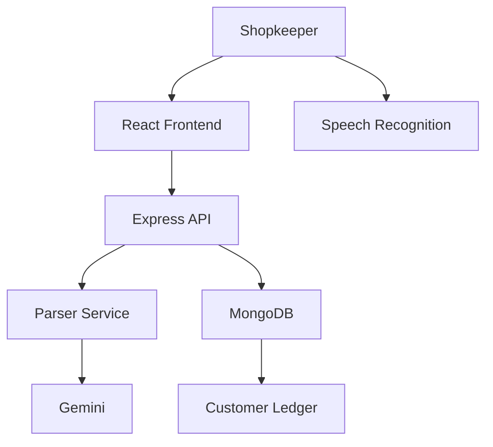

# Pesum Kanakku

Pesum Kanakku is a minimal Tamil/Tanglish voice-first credit ledger for a small shopkeeper. The app helps a shopkeeper record a credit or payment without typing a full accounting interface.

## Problem

In many small shops in Tamil Nadu, ledger books are still maintained on paper. A shopkeeper may remember a customer, a product, a quantity, and a price, but entering it into software can feel slow and confusing. Pesum Kanakku keeps the flow simple: speak the transaction, review it, confirm it, and save it to the ledger.

## MVP solution

This MVP proves the core workflow:

- add or select a customer
- speak or type a transaction
- parse the spoken text into structured data
- review and edit before saving
- save the transaction to MongoDB
- view customer balances and transaction history

## Features

- Select a customer
- Speak a transaction using the browser voice API
- Type a fallback transaction manually
- Parse the transaction text into structured data
- Confirm and edit the extracted details before saving
- Save credit and payment entries
- View customer list with outstanding balance
- View customer details and history
- Basic MongoDB-backed ledger persistence

## Architecture



## Setup

1. Install dependencies:

```bash
npm install
```

2. Start the backend:

```bash
npm run start:server
```

3. Start the frontend:

```bash
npm run start:client
```

4. Or run both together:

```bash
npm run dev
```

## Environment variables

Create a `.env` file in the project root using the example values below:

```env
GEMINI_API_KEY=
MONGODB_URI=mongodb://127.0.0.1:27017/pesum_kanakku
GEMINI_MODEL=gemini-2.5-flash
PORT=5000
```

## API endpoints

- `POST /api/parse`
- `POST /api/customers`
- `GET /api/customers`
- `GET /api/customers/:id`
- `POST /api/transactions`
- `GET /api/transactions`

## Limitations

- speech recognition depends on browser support
- internet is required for Gemini parsing unless the app falls back to a local rule parser
- Tamil speech accuracy requires more testing
- this is an MVP and not a production security-hardened system
- there is no authentication yet

## Notes

This project intentionally keeps the scope narrow and focuses only on the credit-ledger core flow described in the hackathon brief.
